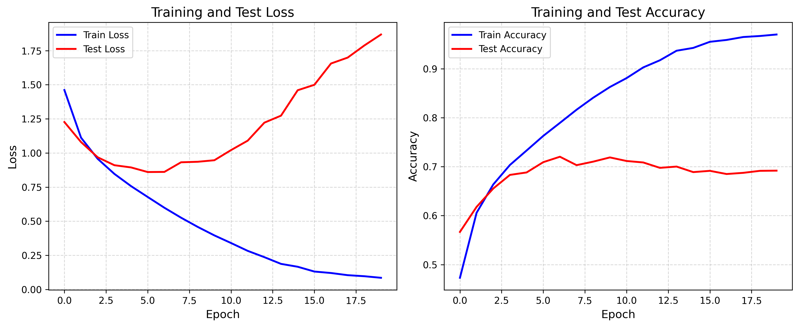
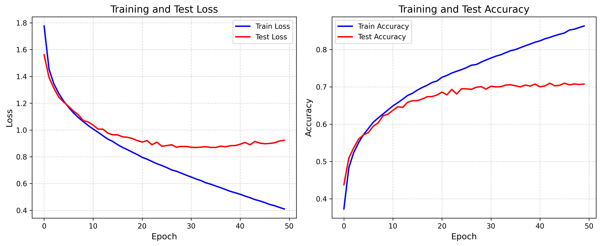
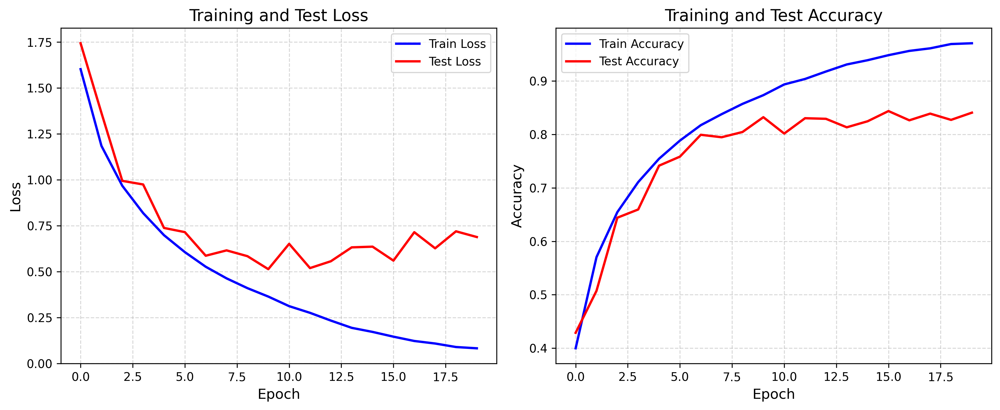
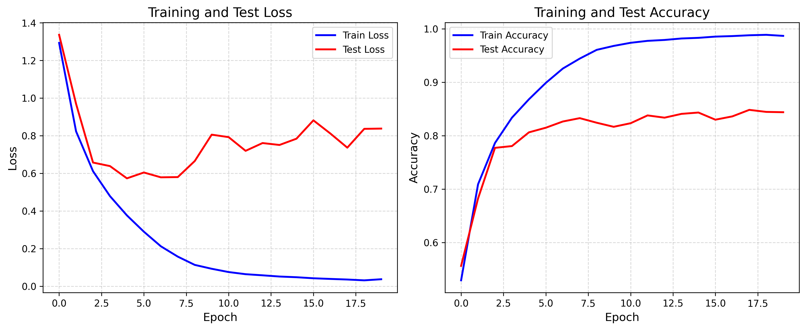
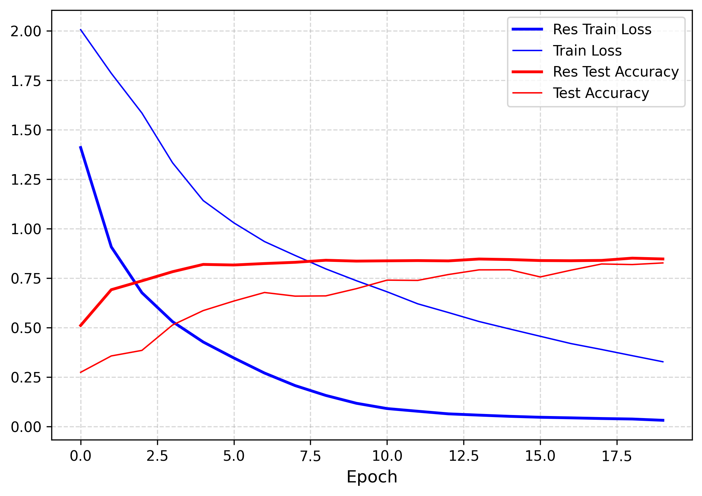

# Pie-Lab 2025年暑期培训

## 实践作业1 残差网络

### 任务介绍

本次任务是Pie-Lab培训中的第一部分，即训练一个卷积神经网络用于图像分类。要求通过一个卷积神经网络（CNN）来实现对CIFAR-10 Dataset进行图像分类任务，在数据集上进行训练，在测试集上验证训练的结果。具体要求为：

- 对网络结构的原理进行解释；
- 实现一个CNN，训练并验证效果；
- 在已实现的CNN上加上残差连接，重新训练并验证效果，与没有残差的CNN进行对比，包括分类精度、收敛速度，分析原因；
- 尝试探究不同超参数、网络层数、残差结构的影响；
- 对实验结果进行可视化，对结果进行总结分析。

### 实验环境

本实验基于[CIFAR-10 Dataset](https://www.cs.toronto.edu/~kriz/cifar.html)，使用Python12结合PyTorch 2.6深度学习框架，使用一块Nvidia TITAN Xp进行训练。

### 实验说明

本项目包含如下文件：

```
.
├── RES_34_curves.png
├── RES_curves.png
├── RESbase_34_curves.png
├── RESbase_curves.png
├── base_curves.png
├── base_curves_1e-3.png
├── base_curves_1e-4.png
├── baseline.py
├── ResNet.py
├── ResNet_base.py
├── predict.py
└── readme.md
```

- `baselin.py`：一个架构类似于LeNet的基本卷积神经网络。
- `ResNet_base.py`：实现了一个不含残差连接的基础卷积神经网络。
- `ResNet.py`：实现了包含残差结构的 ResNet-18 和 ResNet-34。
- `predict.py`：用于从测试集中随机抽取五张图像，进行预测并显示。
- 通过比较不同模型的训练曲线，可以观察残差连接对收敛速度和准确率的影响。

### 实验结果

基线训练曲线，学习率为1e-3，batch size为64，训练20轮：



学习率调整为1e-4，训练50轮：



使用ResNet的模型架构，搭建无残差连接的17层神经网络，训练20轮：



加入残差连接后：



进一步验证，使用34层的神经网络，观察添加残差连接前后的训练结果：



