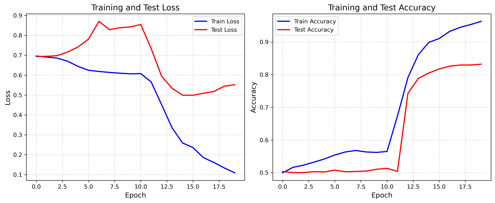

# Pie-Lab 2025年暑期培训

## 实践作业1 残差网络

### 任务介绍

本次任务是Pie-Lab培训中的第一部分本。任务要求通过一个卷积神经网络（CNN）来实现对 CIFAR-10 Dataset 进行图像分类任务；通过PyTorch深度学习框架实现一个LSTM，实现 IMDB 数据集上的文本情感二分类任务。具体要求为：
-  对网络结构的原理进行解释；

-  实现一个CNN，训练并验证效果；

-  在已实现的CNN上加上残差连接，重新训练并验证效果，与没有残差的CNN进行对比，包括分类精度、收敛速度，分析原因；

-  实现一个LSTM，训练并验证效果；

-  在原有 LSTM 网络结构中增加残差连接，重新训练模型，对比加入残差连接前后的性能表现，并分析差异的可能原因；

-  尝试探究不同超参数、网络层数、残差结构的影响；

-  对实验结果进行可视化，对结果进行总结分析。


### 实验环境

本实验基于[CIFAR-10 Dataset](https://www.cs.toronto.edu/~kriz/cifar.html)，使用Python12结合PyTorch 2.6深度学习框架，使用一块Nvidia TITAN Xp进行训练。

### 实验说明

本项目包含如下文件：

```
.
├── results # direction of result images
├── CNN_baseline.py
├── ResNet.py
├── ResNet_base.py
├── predict.py
├── LSTM.py
├── RNN_custom.py
└── readme.md
```

- `CNN_baselin.py`：一个架构类似于LeNet的基本卷积神经网络；
- `ResNet_base.py`：实现了一个不含残差连接的基础卷积神经网络；
- `ResNet.py`：实现了包含残差结构的 ResNet-18 和 ResNet-34；
- `predict.py`：用于从CIFAR测试集中随机抽取500张图像，进行预测并显示混淆矩阵等；
- `RNN_custom.py`：一个手动搭建的单层简单RNN网络；
- `LSTM.py`：通过`nn.LSTM`库搭建的长短期记忆神经网络，包含基本的单层LSTM模型；`LSTMClassifier`、三层不含残差连接的LSTM模型`MultiLayerLSTMClassifier`以及包含残差连接的三层LSTM模型`ResLSTMClassifier`；

### 实验结果

基线训练曲线，学习率为1e-3，batch size为64，训练20轮：


学习率调整为1e-4，训练50轮：


使用ResNet的模型架构，搭建无残差连接的17层神经网络，训练20轮：


加入残差连接后：


进一步验证，使用34层的神经网络，观察添加残差连接前后的训练结果：


在文本情感二分类问题中：

本模型使用`NLTK`作为分词器，主要超参数包括文本最大长度、批次大小（batch size）、学习率和训练轮数等。根据统计，整个 IMDB 训练集和测试集共包含 50,000 条文本，平均文本长度约为 230 个单词，其中 90% 的文本长度不超过 451 个单词。因此，本文将最大文本长度设定为 500。根据工程经验与实际测试，其余超参数设置如下：batch size 设为 64，学习率设为 $1 \times 10^{-3}$，训练轮数设为 20 轮。

在模型结构方面，词汇表大小设为20,000，输入词向量维度为128，LSTM的隐藏状态维度设置为64。基于这些设定，本文实现了一个单层、单向的基本 RNN 模型，并对其进行了训练。

单层CNN训练结果：


单层LSTM训练结果：


三层LSTM不含残差连接训练结果：


包含残差连接（线性全连接）的训练结果：



包含残差连接（不含线性全连接）的训练结果：


