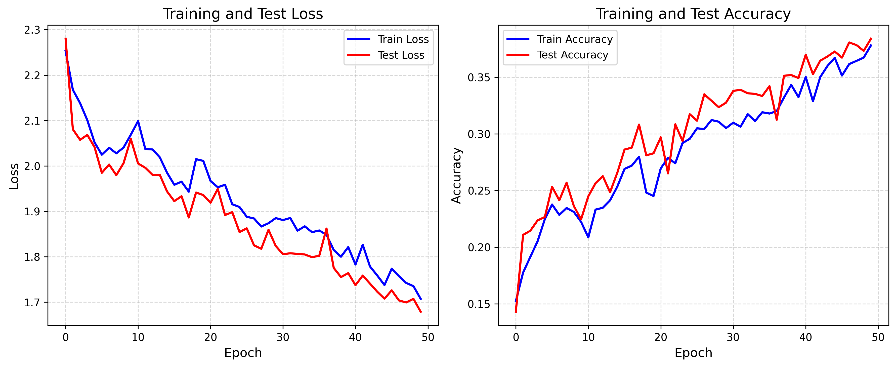
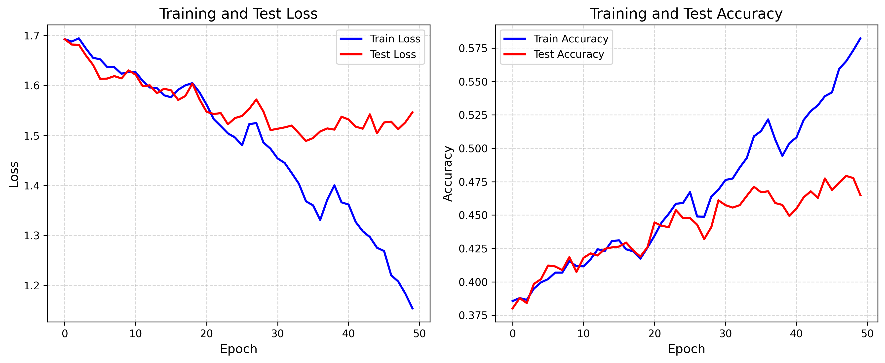
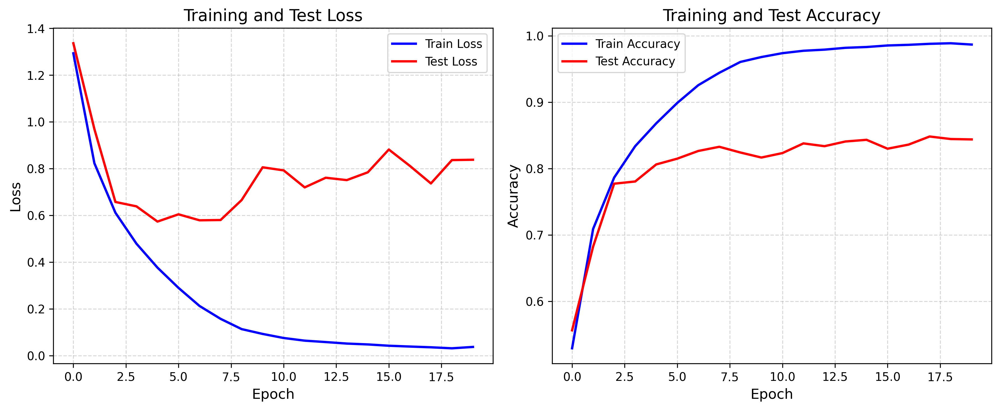

# Pie-Lab 2025年暑期培训

## 实践作业2 掌握注意力机制

### 任务介绍

本次任务是Pie-Lab培训中的第二部分。本任务要求掌握注意力机制，需要理解 Transformer 架构中的核心机制，并完成下列任务：
-  掌握 Attention 和 Self-Attention 的计算原理；
-  掌握 Attention 的矩阵表示与实现方式，了解 Query、Key、Value 的含义和作用；
-  动手实现 Attention 模块，并将其应用于图像分类任务；
-  理解 Vision Transformer（ViT）的基本思想；
-  用自己实现的attention机制仿照ViT的做法搭建网络，并在cifar-10上训练与测试，与前一个实践的 CNN / CNN+ResNet 模型性能进行对比，并分析 Attention 架构的优劣；


### 实验环境

本实验基于[CIFAR-10 Dataset](https://www.cs.toronto.edu/~kriz/cifar.html)，使用Python12结合PyTorch 2.6深度学习框架，使用一块Nvidia RTX3090进行训练。

### 实验说明

本项目包含如下文件：

```
.
├── results # direction of result images
├── transformer.py
└── readme.md
```

- `transformer.py`：一个架构类似于ViT的，基于PyTorch手工搭建的模型，包含了断点保存和继续功能。

参数设置：16个Patch、6层、隐藏层192维、全连接神经网络768维、包含3个注意力头、学习率1e-3。

### 实验结果

训练50轮次：



此时测试集准确率仍在上升。因此从最优模型的断点处开始，再进行50轮训练：



与34层 ResNet 模型在 CIFAR-10 数据集的训练20轮的过程对比：



ResNet的准确率最终收敛于0.88。显而易见的，ResNet模型无论是在收敛速度还是在预测准确率上都远好于ViT模型。
